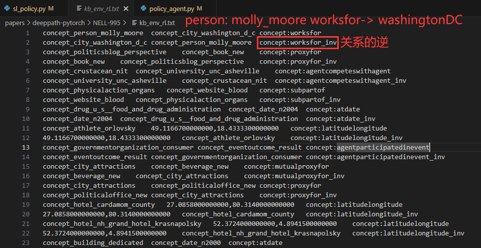

## DeepPath A Reinforcement Learning Method 复现代码

原仓库链接： **[xwhan/DeepPath](https://github.com/xwhan/DeepPath)**

现仓库链接：[YYForReal/deepPath-actor](https://github.com/YYForReal/deepPath-actor)

## 实验环境搭建

### 1. 创建并激活虚拟环境
支持Python 3.7和3.11环境，以下为Python 3.7环境的设置示例：

```bash
conda create -n deeppath python=3.7 pytorch=1.10.0
conda activate deeppath
```

### 2. 安装依赖项

```bash
pip install numpy==1.21.6
pip install wandb==0.16.1
pip install scikit-learn==1.0.2
```

### 3. 数据集准备
下载NELL-995数据集并将其放置在项目根目录中。
[下载NELL-995数据集](https://download.csdn.net/download/HYY_2000/88573274)

### 4. 文件夹目录
在`pytorch`文件夹下创建以下子文件夹以组织代码和输出文件：
- `torchmodels`：存储模型的中间文件。
- `results`：存储实验结果，包括链接预测和事实预测的评估指标。
- `log`：记录实验过程中生成的日志文件。

## 运行流程

### 专家知识监督训练
```bash
python sl_policy_multi.py 
python sl_policy_multi_actor_critic.py
python sl_policy_multi_PPO.py
```

### 强化学习再训练并测试
```bash
python policy_agent_multi.py                            
python policy_agent_multi_actor_critic.py   
python policy_agent_multi_PPO.py                 
```

### 链接预测
```bash
python evaluate_multi.py 
python evaluate_multi_ppo.py 
python evaluate_multi_AC.py 
```

### 事实预测
```bash
python fact_prediction_eval_multi.py          
python fact_prediction_eval_multi_ppo.py
python fact_prediction_eval_multi_AC.py 
```


### 代码说明

- evaluate(\_multi).py

  - 模型训练：使用 train 函数，基于训练数据构建知识图谱，并训练路径特征的模型。

  - 获取路径特征：使用 get_features 函数，从给定的路径特征文件中获取路径信息。

  - 逻辑评估：使用 evaluate_logic 函数，构建知识图谱、训练模型，然后对测试数据进行路径推理和评估。

  - 评估结果输出：输出 RL MAP（平均精度均值）作为评估结果。




## 贡献

### 与已有开源代码对比
我们的复现工作基于GitHub上的[xwhan/DeepPath](https://github.com/xwhan/DeepPath)项目，并在此基础上做出了创新和改进。主要改进包括：

- **工程优化**：
  - 解决硬编码路径问题，增强跨操作系统兼容性。
  - 引入批量处理，提升数据集处理效率。
  - 使用wandb库进行训练过程的可视化分析。
- **算法改进**：
  - 集成基于agent-only的PPO-clip算法。
  - 引入Critic模型优化强化学习策略。（但是平均精度下降了...）


### 其他无关笔记 

#### 损失函数

- **平滑的 L1 损失函数**：用于回归问题，在强化学习中评估Critic网络预测值与实际奖励的差异。
- `value_batch.squeeze()`：压缩Critic网络输出，移除大小为1的维度。
- `reward_batch`：实际奖励值，由环境提供。
- `F.smooth_l1_loss`：计算Critic网络输出与实际奖励的平滑L1损失。

#### 错误点

- 维度错误：使用`F.softmax`时，确保输入张量的最后一个维度是类别维度。
- `np.squeeze(teacher_state_batch)`：移除单维度，但需注意保留批处理大小维度。

#### 比较方法

- **A2C（Advantage Actor-Critic）**：基于策略梯度的Actor-Critic算法，优化动作的优势函数。
- **PPO（Proximal Policy Optimization）**：通过"clip term"约束策略更新步骤的大小，防止大幅更新。

#### 分析

- 当模型性能或损失趋于平稳，梯度应趋向于0。
- 如果梯度减小但性能未达预期，可能陷入局部最优，考虑提高学习率或减少正则化约束。
- Critic的输出可能有正有负，且不需要输出概率，所以不需softmax激活；通常使用均方差（MSE）作为损失函数。


#### 错误点

1. Dimension out of range (expected to be in range of [-1, 0], but got 1)

在使用F.softmax时出现了维度错误。这通常是由于输入张量的维度不正确导致的。
由于state的维度不符合F.softmax的期望。F.softmax函数通常用于处理类别概率分布，要求输入张量的最后一个维度是类别维度。

检查在调用F.softmax之前的state张量的维度，并确保它符合F.softmax的期望。你可以使用state.shape来检查state张量的形状，然后根据需要进行调整。

如果state张量的最后一个维度不是类别维度，你可能需要在调用F.softmax之前对其进行转置或调整。
例如，如果state的形状是(batch_size, num_features)，你可以使用state = state.unsqueeze(dim=-1)来添加一个类别维度。


2.  np.squeeze(teacher_state_batch) 的作用是去除数组中的单维度，返回一个维度更小的数组。如果 teacher_state_batch 是一个多维数组，那么 np.squeeze 可以帮助去除维度为1的维度，从而简化数组的形状。

但是，如果 teacher_state_batch 的维度已经是 (batch_size, ...) （其中 batch_size 是批处理大小，... 表示其他维度），使用 np.squeeze 可能会将 batch_size 这一维度也去除掉，导致形状不再符合期望。

为了确保 state 具有正确的形状，可以使用 np.reshape 或 np.expand_dims 来显式调整 teacher_state_batch 的形状，以确保 state 保留 batch_size 维度。


### AC 参考

https://blog.csdn.net/shoppingend/article/details/124341639

### PPO trick参考

https://zhuanlan.zhihu.com/p/512327050


#### 后续存档（方便回滚）

- 12.5 ppo agent only
- (12.17 14:14)：
   - 自定义Adam优化器的 epsilon 默认1e-8 custom_eps = 1e-5
   - trick : state_normalization use_state_norm = True
- 12.24: 环境Env重构

